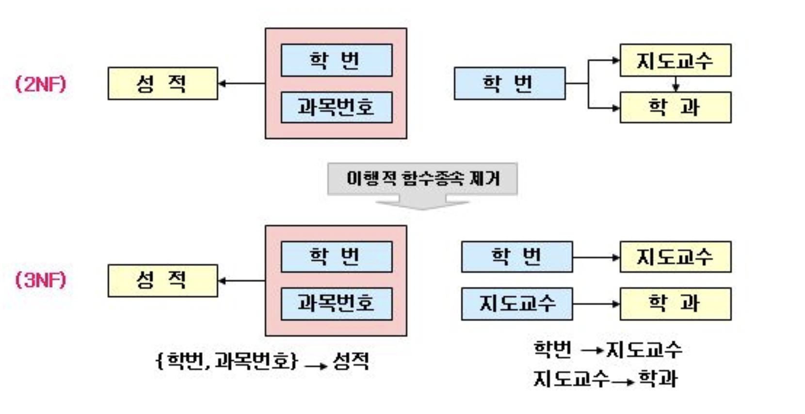

# DB 정규화

## 정규화란?
- 정보의 중복으로 발생하는 문제들을 해결하기 위해 relation을 여러개로 분리하는 과정
- 정보의 중복으로 발생하는 문제는 저장공간의 낭비와 이상 현상 발생을 들 수 있다
- 정규화로 분해된 relation은 무손실 조인이 보장되어야 한다.
  - 무손실 조인 = 분해된 테이블을 다시 합쳤을 때 원래 테이블이 나와야 하는것 

## 이상 현상
이상현상에는 삽입이상, 삭제이상, 수정이상이 있다.
1. 삽입 이상
   - 불필요한 정보를 함께 넣지 않으면 데이터 삽입이 불가능 한 경우
   - 사용자 테이블에 특정 의류에 대한 할인 적용 여부 속성을 넣게 되면, 해당 의류를 구매 하지도 않는 사용자에게는 불필요한 정보를 입력해야 한다.
2. 삭제 이상
   - 필수적인 정보를 삭제하지 않으면 삭제가 불가능 한 경우
   - 사용자 테이블에 특정 이벤트 참여 여부가 있는 상황에서, 이벤트 참여 여부를 delete하면 사용자 정보까지 모두 delete 되게 된다.
3. 수정 이상
   - 반복된 데이터 중 일붑만 수정하면 데이터 불일치가 발생하는 경우
   - 같은 사용자 고유 id가 중복되어 나타나는 테이블의 경우, 한 레코드의 데이터를 변경 할 시 다른 레코드와 달라지게 되는 문제

## 함수적 종속성

### 종속성 규칙

- 위 규칙을 적용하여 정규화 진행 
- X -> Y이면 X가 Y에 대한 결정자라고 하고, Y를 종속자라 한다
  - 회원 id -> 회원 이름
    - 특정 회원 id에 대해 회원 이름은 유일하게 존재한다
    - 즉 id와 이름은 함수적 종속성을 갖는다

### 완전 함수 종속성
종속자가 기본키에만 종속되며, 기본키가 여러 속성으로 구성되어 있을 경우 기본키를 구성하는 모든 속성이 포함된 기본키의 부분집합에 종속된 경우를 완전함수 종속이라고 한다.

### 부분 함수 종속성
릴레이션에서 기본키가 복합키일 경우 기본키를 구성하는 속성 중 일부에게 종속된 경우를 부분함수 종속이라고 한다.
- 부분 함수 종속성은 깨주는게 좋다

### 이행 함수 종속성
릴레이션에서 X, Y, Z라는 3 개의 속성이 있을 때 X→Y, Y→Z 이란 종속 관계가 있을 경우, X→Z가 성립될 때 이행적 함수 종속이라고 한다.
- 이행적 함수 종속도 깨주는게 좋다

## 정규화 과정

### 제 1 정규화
모든 attribute의 '값'은 원자 값만 갖아야 한다. 
- 리스트 형태로 들어가있다면, 여러개의 레코드로 나누어 줘야 한다
- 나누어 준 후 중복이 발생한다면, 테이블을 분해 해줘야 한다.

### 제 2 정규화 (기본키가 두개 이상일때만 고려!)
제 1 정규형을 만족한 상태에서, 기본키 제외 모든 attribute가 기본키에 완전 함수 종속이 되도록 relation을 분해한다.
  
출처: https://m.blog.naver.com/PostView.naver?isHttpsRedirect=true&blogId=k97b1114&logNo=140148822753  

### 제 3 정규화
릴레이션이 제 2 정규형을 만족하고, 기본키가 아닌 모든 attribute가 기본키에 이행적 함수 종속이 되지 않도록 릴레이션을 분해한다.
  
출처: https://m.blog.naver.com/k97b1114/140148913593  
해당 예시에서 학번 -> 지도교수 -> 학과의 이행적 함수 종속을 제거한다

### 보이스/코드 정규화(BCNF)

학생 -> 교수 /// 교수 -> 과목으로 테이블 분해
- 릴레이션이 제 3 정규형을 만족하고, 모든 결정자가 후보키인 상태를 말한다.  
- BCNF는 일반적으로 스토리지 효율성을 높이고 특정 유형의 데이터 불일치를 방지하므로 사용하는것이 좋다. 다만 성능이 문제가 되기 시작하면 3NF(Third Normal Form)으로 되돌린다

## 정규화의 장, 단점
- 정규화는 데이터 중복으로 인한 이상현상을 해결할 수 있고, 스토리지 효율성을 높이는 장점 이있다. 때문에 오류를 줄일 수 있는 장점이 있다.
- 테이블이 많아지면 필연적으로 Join 횟수도 많아지게 된다. join은 성능상 코스트가 크고, 임시테이블 생성으로 인한 메모리 비효율 문제도 발생하게된다.

## 참고 자료 
https://developer111.tistory.com/80
