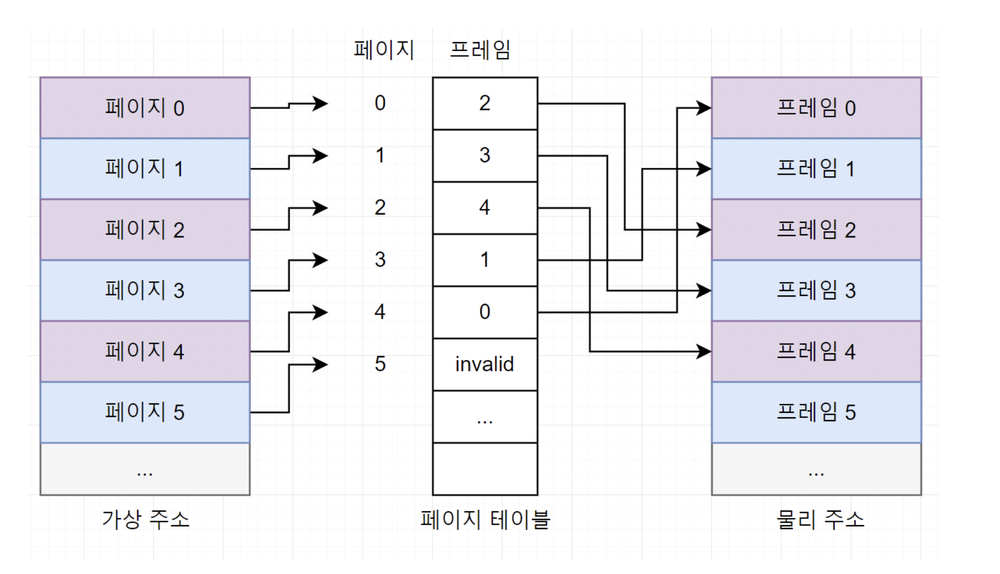
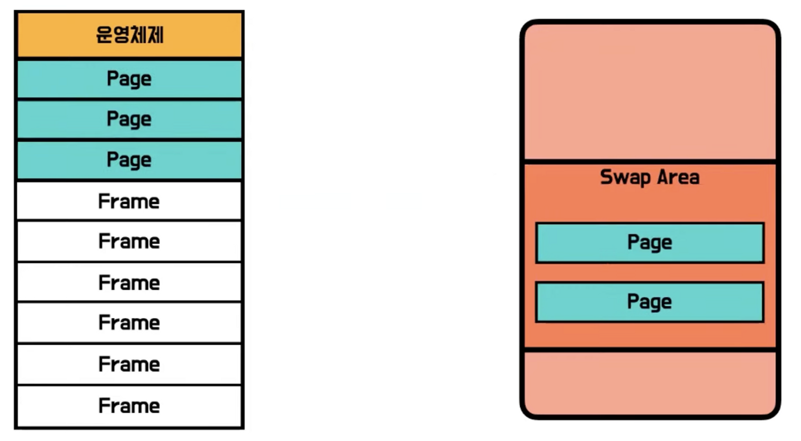

# 가상메모리

## 가상 주소란?
- 가상 주소 공간은 각 프로세스 당 주어지는 논리적인 공간이다
- 가상 주소 공간의 크기는 물리 메모리(RAM)의 크기와는 독립적이다
- 32비트 프로그램의 경우, 약 43억 바이트(약 4GB)의 배열형태로 되어있다 (64비트의 경우 2^64바이트 만큼의 크기)
- 모든 논리 주소가 반드시 물리적인 메모리의 물리 주소로 할당 받는 것은 아니다, 때문에 실제 물리 메모리보다 가상메모리들이 더 사이즈가 클 수 있는것

## MMU(Memory Management Unit)란?
- 가상 주소를 실제 메모리 주소로 변환해주는 도구
- 가상(논리적) 주소를 메모리의 물리적 주소로 변환하는것을 주소 바인딩이라고 부른다

## Frame과 Page, 페이지 테이블

- Frame은 물리 메모리를 일정한 단위로 나눈것
- Page는 프로세스를 일정한 단위로 나눈것
- 가상메모리의 페이지 주소는 페이지 테이블을 통해 물리주소의 프레임과 매핑될 수 있다
- Paging 기법이란 당장 사용하지 않는 page를 스왑공간(보조기억장치에 존재)에 넣는것을 말한다
  
  * 출처: 유튜브 테코톡

## 페이지 폴트란?
프로세스의 주소 공간에는 존재하지만, 지금 이 컴퓨터의 RAM에는 없는 데이터를 접근하는 경우 발생  
- Major page fault
  - 요청한 페이지가 물리 메모리로부터 스왑아웃(Swap-Out)되어 보조기억장치의 가상 메모리에 저장되어 해당 페이지를 다시 물리 메모리로 스왑인(Swap-In) 해야할 때 발생
- Minor page fault
  - 요청한 페이지가 물리 메모리에는 로드되었지만 메모리 관리 유닛(Memory Management Unit, MMU)에는 로드되어있지 않다고 표시된 경우 이를 Minor 페이지 폴트라 한다
- Invalid page fault
  - 요청한 페이지가 스왑영역의 밖을 참조하거나, 페이지를 쓰기 불가능한 영역에 쓰려고할 때 발생
  - 블루스크린의 원인

## 가상메모리란?
- 프로세스 전체를 메모리에 올리지 않아도 실행이 가능하도록 하는 메모리 관리 기법
- 물리적 메모리 관리를 추상화하여 고차원적으로 메모리 관리를 가능케 해준다
- 가상메모리가 좋은점은 OS의 Memory manager에 의한 관리가 좋다는점. 만약 프로세스 A가 죽는다면, 맵핑테이블의 데이터를 지워주고, 물리 메모리 데이터를 신속히 회수! 때문에 자원낭비가 없다

