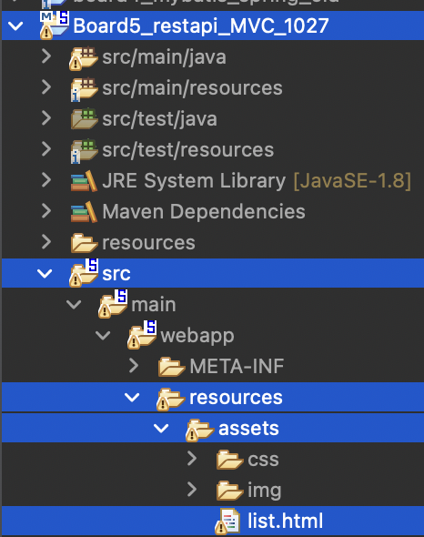
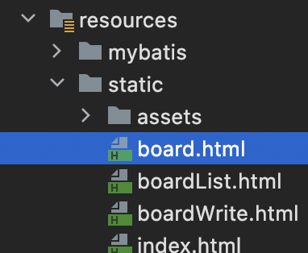

# 스프링에서 내가 애매했던 부분 정리

### ✒︎ 스프링 레거시 MVC의 servlet-context.xml의 <**resources** mapping=*"/assets/**"* location=*"/resources/assets/"* />
- /assets/~~ 이런 요청이 오면 경로를 */resources/assets/ 여기로 잡자는것* 
- *resources 하위엔 png, css, … 까지 다 있고, views에는 jsp만 있음.*
    
    ```java
    @GetMapping("/list")
    	public String list() {
    		return "redirect:/assets/list.html";
    	}
    ```
    
    
    
    /assets/list.html URL로 리다이렉트를 치는거니까 실제 url은 http://localhost:8080/board/assets/list.html 로 구성되고 (”/”가 http://localhost:8080/board/assets/list.html 이라서) /resources/assets/ 에 있는 list.html을 브라우저에 갖다줌. (html을 요청하는거니까 당연히 웹서버만 동작)
    
### ✒︎ href="/test"
- 브라우저에서 서버에 저 url로 요청을 보낸것 
- 이렇게 상대경로로 href="board.html"를 걸면 어떻게 되는가?
    
    ```html
    <a data-toggle="modal" class="nav-link" 
    	href="board.html" id="boardNoticeTag">공지사항</a>
    ```
    
    
    
    → 저 파일 위치에 해당하는 path를 뽑은뒤 http://localhost:8080/board.html (참고로 /가 디폴트 context path니까 스프링 부트) 과 같이 구성해서 웹서버에 보냄(html을 달라고 했으니 웹서버고, 따라서 웹 어플리케이션으로 요청이 안가고, 서블릿이 안돌아감). html 폼을 서버에서 보낸것이니까 당연히 동기고 깜빡임이 당연히 일어난다. 
    
### ✒︎ 브라우저에서 서버로 요청보낼 때 “/board/wirte” 의 의미
- @RequestMapping과 @Get/PostMapping에 맵핑 되는곳의 명령으로 보내자!

### ✒︎ 동기방식에서 컨트롤러 메소드 리턴 값의 “board/wirte” 의미
- 뷰리졸버 prefix에 등록된곳에서 보이는, board 디렉토리의 write.jsp로 가자는것 

### ✒︎ “/”의 의미 
- Spring Boot에서는 default context path를 "/"로 설정한다.

### ✒︎ ModelAndView 객체 
- view에게 데이터를 전달할때 ModelAndView를 이용해서 Model,Path,Status 정보를 한번에 보낼 수 있게 만드는 것이 바로 ModelAndView

-     
    ```java
    ModelAndView mav = new ModelAndView();
    //		try {
    		List<BoardDto> list = boardService.listArticle(map);
    		PageNavigation pageNavigation = boardService.makePageNavigation(map);
    		mav.addObject("articles", list);
    		mav.addObject("navigation", pageNavigation);
    		mav.addObject("pgno", map.get("pgno"));
    		mav.addObject("key", map.get("key"));
    		mav.addObject("word", map.get("word"));
    		mav.setViewName("board/list");
    		return mav;
    ```
    
    파라미터로 받는 Model 객체에 하는 것 처럼 addObject를 통해 request.setAttribute()를 쓰는 것 같이 쓸 수 있고, setViewName을 통해 view를 지정할수도 있다. 리턴으로 ModelAndView 객체를 리턴한다. 또한 httpstatus 정보도 넣어줄 수 있음.
    
    뷰에서 받을땐 EL로 받을 수 있음. ${articles} 요렇게.. 
    
### ✒︎ ResponseEntity 객체
- 비동기에서 out버퍼에 보낼 데이터와 HttpStatus를 함께 보낼 수 있게 해줌.
    
    ```java
    @ResponseBody
    @GetMapping("/user/{myuserid}") // userid는 내가 붙이고 싶은 이름으로 써도 됨 
    	public ResponseEntity<?> userView(@PathVariable("myuserid") String userId) { // path variable로 오면 @PathVariable로 받는다.
    		try {
    			
    			MemberDto memberDto = memberSerivice.getMember(userId);
    
    			if(memberDto!=null) {
    				return new ResponseEntity<MemberDto>(memberDto, HttpStatus.OK);
    			}else {
    				// 멤버가 없을 때 
    				return new ResponseEntity<Void>(HttpStatus.NO_CONTENT);
    			}
    			
    		} catch (Exception e) {
    			e.printStackTrace();
    			// 에러가 난것을 알려줌
    			return new ResponseEntity<String>("Error : " + e.getMessage(), HttpStatus.INTERNAL_SERVER_ERROR);
    		} 
    	}
    ```
    
    Javascript에서는 아래와 같이 resp 객체를 .json()으로 js object로 만들어 주기만 하면 매우 쉽게 dto 정보 꺼내기 가능!!
    
    ```jsx
    fetch(`${root}/admin/user/${id}`) // 회원 정보 삭제에서 fetch한 url이랑 똑같은 문제 발생 
        		.then(response=>response.json())
        		.then((data)=>{
        			// 회원 정보 모덜에 정보 채우기 
        			document.querySelector("#vid").innerText = data.userId;
        			document.querySelector("#vname").innerText = data.userName;
        			document.querySelector("#vemail").innerText = data.emailId + "@" + data.emailDomain;
        			document.querySelector("#vjoindate").innerText = data.joinDate;
        			modal.show();
        		});
    ```
    
### ✒︎ 여러 요청관련 어노테이션 
- @RequestMapping  
        1. URL에 매칭되는 명령을 수행하기 위해 사용함. class, method에 둘다 사용할 수 있다. 반면 GetMapping, PostMapping 이런애들은 메소드에만 사용 가능함.  
        2. 그러면 다 RequestMapping만 쓰지 왜 GetMapping, PostMapping 쓰나? -> rest api로 url을 중복 사용하기 위함임. 
- @RequestParam  
        1. Controller 메소드의 파라미터와 웹요청 파라미터와 맵핑하기 위한 어노테이션  
        2. public String write(RequestParam Map<String, String> map, Model model)과 같이 썼을 때    
            -  파라미터가 많아지면 일괄적으로 map으로 받을 수 있음.   
            -  Model은 서블릿으로 개발할때 jsp로 인자를 던질때 쓰던 request.setAttribute() 역할이랑 비슷하다고 보면됨. 스프링에선 그걸 Model객체로 함.
            
    
                
    요렇게 jsp로 넘기고, jsp에선 EL로 받는다.
                
    
