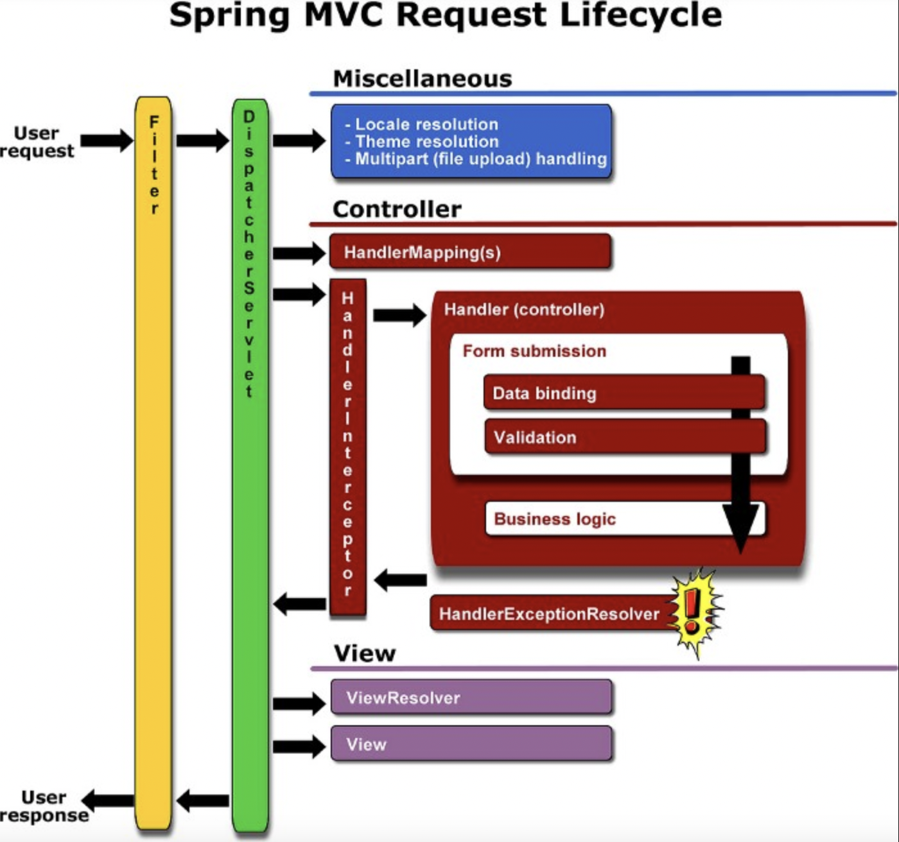

# 스프링 MVC 동작 과정 

## 🖌 Spring MVC란?
- Spring MVC는 MVC(Model-View-Controller) 아키텍처를 사용하여 웹 애플리케이션 구축을 지원하는 Spring 프레임워크의 모듈 
- 웹 개발을 위해 특별히 설계되었으며 request mapping, view resolving과 같은 기능을 제공
  - view resolving: 컨트롤러에서 요청을 처리하고난 후 결과를 보여주기 위해 뷰를 선택, view resolver를 통해 호출

## 🖌 Spring MVC 동작 과정

클라이언트의 요청에서 서버의 응답까지 Spring 프레임워크의 작동 프로세스

1. 클라이언트가 요청을 보냄 
   - 클라이언트(예: 웹 브라우저)가 서버에 요청을 보낼 때 프로세스가 시작 됨
2. Filter를 거쳐 DispatcherServlet이 요청을 수신
   - 요청은 먼저 Spring MVC 프레임워크에서 프런트 컨트롤러 역할을 하는 DispatcherServlet에 의해 수신, 적절한 컨트롤러에 대한 요청 위임을 담당
3. HandlerMapping은 클라이언트의 요청 url을 참고하여 적절한 컨트롤러 Bean을 식별 및 DispatcherServlet에 전달
4. DispatcherServlet은 요청을 Handler interceptor를 거친 후 전달받은 컨트롤러 Bean 객체를 처리할 수 있는 HandlerAdapter 에게 요청 처리를 위임
   - 즉, HandlerMapping이 결정한 handler(controller)를 HandlerAdapter 수행 전과 후로 인터셉터를 통과 하도록 한다
5. 컨트롤러가 요청을 처리한다, 컨트롤러는 비즈니스 로직을 수행하거나 데이터베이스와 상호 작용하거나 다른 작업을 수행할 수 있는 적절한 서비스 및 DAO 계층 빈을 호출하여 요청을 처리한다
6. HandlerAdapter 수행 완료 후 다시 인터셉터를 거치고 DispatcherServlet으로 흐름이 전달되는데, ModelAndView를 전달한다
7. DispatcherServlet은 ViewResolver를 통해 응답으로 적절한 뷰를 찾는데, 이때 ViewResolver는 ModelAndView의 뷰 이름에 해당하는 View객체를 찾거나 생성한다
8. 마지막으로 Filter를 거친 후 클라이언트에게 응답을 반환한다
