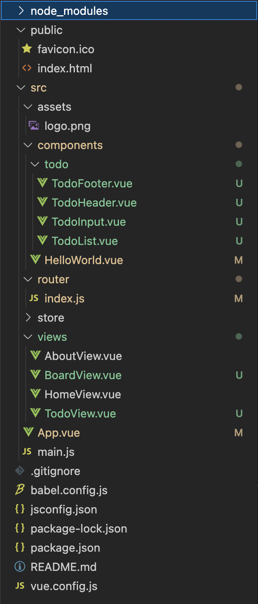

# Vue를 CLI 환경에서 사용하기 

## CLI 프로젝트 디렉토리 구조


1. 전체 큰 판떼기 = public/index.html
2. 판떼기에 붙일 도메인 별로 나눈 큼직한 포스트잇 = src/views/*.vue
3. 포스트잇 속의 조그만한 포스트잇 = src/components/{domain}/*.vue

## 순서
1. 맨 처음에 index.html에 있는 `<div id="app"></div>`를 보고 App.vue를 간다.
2. App.vue
```html
<template>
  <div id="app">
    <!-- nav에서 클릭하면 라우팅되고 -->
    <nav>
      <router-link to="/">Home</router-link> | 
      <router-link to="/about">About</router-link> |
      <router-link to="/board">게시판</router-link> |
      <router-link to="/todo">Todo</router-link>
    </nav>
    <!-- 뿌리는 위치는 여기에 뿌리겠다 -->
    <router-view />
  </div>
</template>
```
App.vue의 template 태그. router-link 태그를 통해 라우팅 한다.(이때 라우팅은 서버로 흐름을 보내지 않고, 마치 html의 a태그에 #을 붙여준것과 같이 클라이언트의 다른 위치로 흐름을 넘기는것을 말함)  

router-link 태그에 의해 router 디렉토리의 index.js가 수행된다.  

해당 위치의 내용을 router-view 태그 부분에 뿌린다.  

3. router/index.js

```javascript

import HomeView from "../views/HomeView.vue";
import BoardView from "../views/BoardView.vue";

Vue.use(VueRouter);

const routes = [
  {
    path: "/",
    name: "home",
    component: HomeView,
  },
  {
    path: "/about",
    name: "about",
    component: () => import("../views/AboutView.vue"),
  },
];

...
```
만들어져 있는 routes 배열에 라우팅 정보를 설정한다.
- 각 객체 하나 하나를 도메인 별로 나눈 포스트잇이라 생각할것.
- path에 router-link 태그의 to 값을 똑같이 넣어준다.
- name은 필수는 아니고 이름 붙여준것
- component에 라우팅할 vue 컴포넌트(도메인별로 나눈 큼직한 컴포넌트, TodoView같이 {도메인+View}로 네이밍하며, 파스칼 네이밍 룰을 따름)를 지정 해 주는데, import해서 넣어준다. 이때 파스칼 네이밍 룰로 설정해줌. 혹은 화살표 함수 형태로 바로 import 해줘도 됨.

4. 지정한 큼직한 컴포넌트를 실제로 생성하기 
- src밑에 views 디렉토리밑에 *.vue 파일을 만들어 준다. 
```javascript
<template>
  <div class="todo">
    <h1>투두</h1>
    <div>
      <!-- 자식 컴포넌트들 @addTodo / 바인딩으로 자식에게 넘기고, 자식에선 props로 받는다  -->
      <todo-header></todo-header>
      <todo-input @addTodo="addTodo"></todo-input>
      <todo-list :todos="todos"></todo-list>
      <todo-footer :todos="todos"></todo-footer>
    </div>
  </div>
</template>
```
큼직한 포스트잇에 template을 하나 파고 거기다 내가 사용할 자식 컴포넌트들을 태그로써 선언 해 두는()


1. 큼직한 포스트잇 컴포넌트에 붙일 잔바리 컴포넌트(자식 컴포넌트)를 실제 생성
이때 게시판이면 게시판, todo면 todo 이렇게 디렉토리를 세분화 해서 구성하면 좋다.